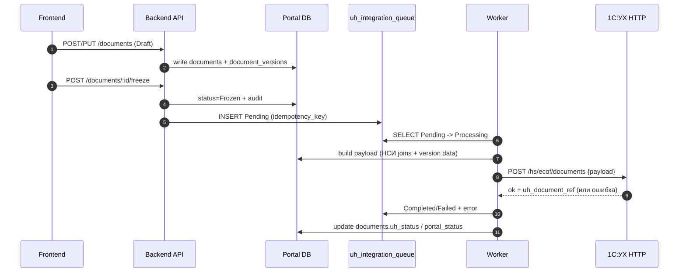
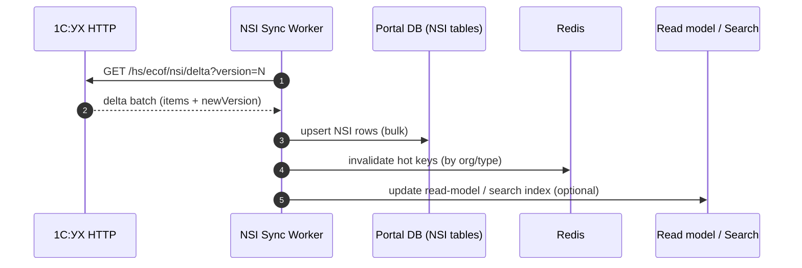

# Архитектура high-load: Портал ↔ 1С:УХ

Ниже — рекомендуемая схема взаимодействия для высоконагруженной системы (ЕЦОФ), где **пользователь работает только в портале**, а **1С:УХ — учетное ядро** (проведение/регламент/отчетность).

Документ сфокусирован на:
- **где и как хранятся данные** (операционная БД, read-модель, outbox/очереди)
- **как кэшировать большие справочники/карточки** (НСИ, object_cards)
- **как выглядит поток “документ → УХ → статусы/отчетность”**

---

## 1) Компоненты и контуры

### 1.1. Логическая схема (компоненты)

```mermaid
flowchart LR
  %% UI
  U[Пользователь: бухгалтер/дочка] -->|HTTPS| FE[Portal Frontend (Vite/SPA)]
  FE -->|REST/JSON| API[Portal Backend API (Node/TS)]

  %% Core DBs
  API -->|SQL| DB[(Portal DB: Postgres)]
  API -->|Redis GET/SET| R[(Cache: Redis)]

  %% Read model / search (опционально для high-load)
  API -->|queries| RDB[(Read DB / Replica / отдельная БД)]
  API -->|search| SRCH[(Search: Elastic/OpenSearch)]

  %% Files
  API -->|put/get| FS[(Object storage: S3/MinIO/FS)]

  %% Background processing
  DB -->|outbox/queue rows| W[Workers / Queue processors]
  W -->|update statuses| DB
  W -->|warm cache| R
  W -->|update index| SRCH

  %% Integration with 1C UH
  W -->|HTTP Services /hs/ecof/*| UH[1С:УХ (HTTP-сервисы)]
  UH -->|SQL| UHDB[(UH DB: MS SQL / Postgres)]

  %% NSI sync
  UH -->|NSI delta /hs/ecof/nsi/delta| W
```

**Смысл разделения:**
- **Portal DB** — источник истины для портальных сущностей (документы, версии, файлы, очередь интеграции, object cards).
- **Read DB / Search** — ускорение чтения/поиска по “тяжелым” данным (не обязательно на старте, но желательно для high-load).
- **Redis** — быстрые “горячие” lookup’и, кэш справочников и прав/подписок.
- **Workers** — асинхронные операции (интеграция с УХ, синхронизация НСИ, построение витрин, прогрев кэшей).

---

## 2) Где хранятся данные (слои данных)

### 2.1. Операционная БД портала (Postgres) — *write model*

Ключевые группы таблиц (у вас в проекте уже есть большая часть):
- **Документы**: `documents`, `document_versions`, `document_files`, `document_checks`, `document_history`
- **Очередь интеграции**: `uh_integration_queue` (идемпотентность, ретраи, статусы)
- **НСИ (копия/кэш из УХ)**: `organizations`, `counterparties`, `contracts`, `warehouses`, `accounts`, `accounting_accounts`, `organization_divisions`, `nomenclature`  
  (синхронизация: `backend/src/services/nsi-sync.ts`, см. `docs/INTEGRATION-1C-UH.md`)
- **Объекты учета**: `object_types`, `object_type_schemas`, `object_cards`, `object_card_history`, `object_events`
- **Подписки**:
  - аналитики (субконто): `org_analytics_subscriptions`
  - объекты учета (v2): `org_object_type_subscriptions`, `org_object_card_subscriptions`

### 2.2. Read model (витрина) — *ускорение чтения*

Для high-load обычно выносят “тяжелые” чтения из write-модели в один из вариантов:
- **read replica Postgres** (самый простой старт)
- **отдельная БД read-model** (если реплика не подходит по SLA/нагрузке)
- **денормализованные таблицы/материализованные представления** (в той же БД или в отдельной)

Типовые read-модели:
- `nsi_lookup_*` — плоские таблицы для select’ов (id, code, name + нужные атрибуты), с индексами под UI-поиск
- `object_cards_search` — плоская витрина карточек (type_id, org_id, status, code, name, “важные” attrs), чтобы не сканировать JSONB и не делать тяжелые JOIN’ы
- `documents_list_view` — витрина для списка документов (самые частые фильтры/сортировки)

**Обновление read-model:**
- либо по расписанию (batch) + инкрементальные маркеры
- либо event-driven: триггеры → outbox → воркер обновляет read-model и/или search index

### 2.3. Redis — кэш “горячих” данных

Рекомендуемые классы кэша:
- **НСИ lookup** (top-N популярных значений): ключи вида `nsi:{type}:{orgId}:{qHash}` с TTL 5–30 мин
- **подписки/права**: `subs:analytics:{orgId}` и `subs:objects:{orgId}` (TTL 1–10 мин + инвалидация по изменению)
- **read-through** кэш карточек: `objectCard:{id}` / `objectCards:{typeCode}:{orgId}:{qHash}`

Важно: Redis — это **ускоритель**, источник истины остаётся в БД.

---

## 3) Потоки данных (высоконагруженные сценарии)

### 3.1. Поток “документ → заморозка → очередь → 1С:УХ → статусы”



**High-load детали:**
- idempotency: `uh_integration_queue.idempotency_key` + проверка дублей
- ретраи: экспоненциальная задержка и `retry_count`, фиксация ошибок
- “длинные” операции только в воркерах, UI получает быстрые ответы

### 3.2. НСИ: синхронизация из УХ (дельта) + витрина/кэш



**Чтобы большие НСИ не “убивали” API:**
- не отдавать “всё сразу”, только **поиск с лимитом** + keyset pagination
- держать **плоские lookup-таблицы** или индекс (search engine)
- прогревать Redis по самым частым запросам (top orgs / top types)

### 3.3. Карточки объектов: подписки ALL vs SELECTED

**Задача:** в формах документов показывать **только разрешённые карточки**.

Модель:
- `org_object_type_subscriptions.mode = ALL` → разрешены все карточки типа, видимые организации (общие + свои)
- `mode = SELECTED` → разрешены только карточки из `org_object_card_subscriptions`

Рекомендуемая реализация:
- API чтения карточек для UI всегда идёт через “подписанный” endpoint (`/objects/subscribed-cards`)
- валидация на backend при сохранении документа проверяет, что выбранный `objectCardId` разрешён подписками

---

## 4) Как кэшировать/выносить “большие таблицы”

Ниже — практическая схема “куда класть большие данные”, не ломая консистентность.

### 4.1. НСИ (contracts/counterparties/nomenclature и т.п.)

**Источник истины**: таблицы НСИ в Portal DB (после sync из УХ).  
**Read-модель** (опционально): `nsi_lookup_*` или Search-индекс.

**Почему так:**
- UI делает много “поисковых” запросов (ILIKE) → лучше плоские lookup/индекс
- данные часто “почти неизменны” → кэшируется очень эффективно

### 4.2. object_cards (карточки объектов учета)

Проблема: `attrs JSONB` + поиск/фильтрация/выборки.

Решение:
- **write model**: `object_cards` (как есть)
- **read model**:
  - таблица `object_cards_search` (денормализованные колонки под фильтры)
  - опционально search индекс для full-text
- **Redis**:
  - кэш “директории” по typeCode/orgId и строке поиска (маленькие страницы)

### 4.3. Очереди/интеграция (uh_integration_queue)

Уже хороший подход:
- очередь хранится в БД (персистентность)
- воркеры обрабатывают “Pending → Processing → Completed/Failed”

Для high-load добавляют:
- шардирование/партиции по `created_at` (если очередь огромная)
- отдельный воркер-пул на разные типы операций
- метрики/дашборд по статусам очереди

---

## 5) Итоговая схема “портал как единое окно, УХ как backend”

**UI**: быстрый портал (поиск/создание/заморозка/статусы)  
**Асинхронка**: всё тяжелое в воркерах  
**УХ**: проведение, регламент и отчетность  
**НСИ**: мастер в УХ → дельта в портал → кэш/read-model для скорости  

Если нужно, могу дополнить этот документ конкретным “слоем витрин” под ваш кейс (какие именно `nsi_*` и `object_cards` будут самыми тяжелыми, какие индексы/партиции нужны, и какие ключи Redis лучше использовать).

